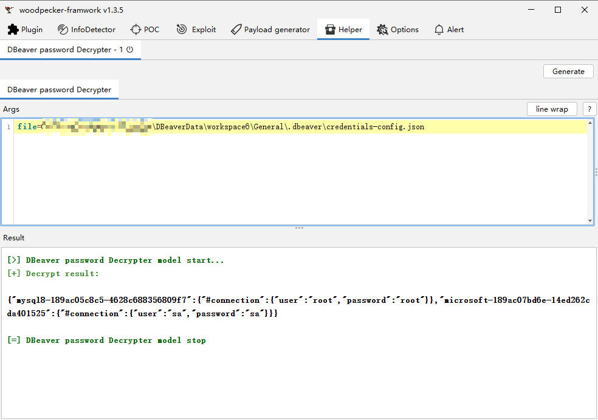

## 0x01 简介

DBeaver-decrypter 是一款用于解密DBeaver数据库软件保存的密码的 woodpecker 插件。

## 0x02 演示

```
 密码文件：
 C:\Users\Administrator\AppData\Roaming\DBeaverData\workspace6\General.dbeaver\credentials-config.json

 连接信息：
 C:\Users\Administrator\AppData\Roaming\DBeaverData\workspace6\General.dbeaver\data-sources.json
```




## 0x03 参考文献

- https://stackoverflow.com/questions/39928401/recover-db-password-stored-in-my-dbeaver-connection/57630312#57630312